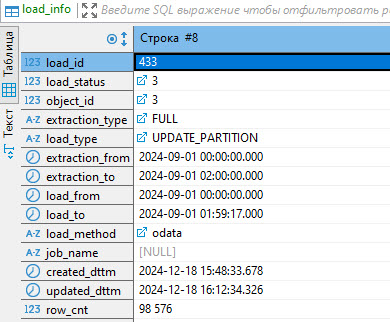
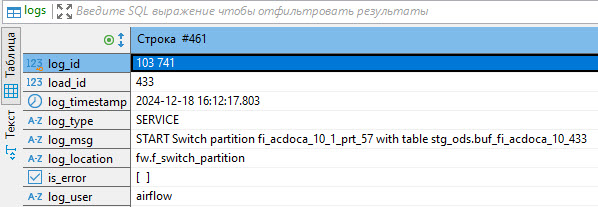
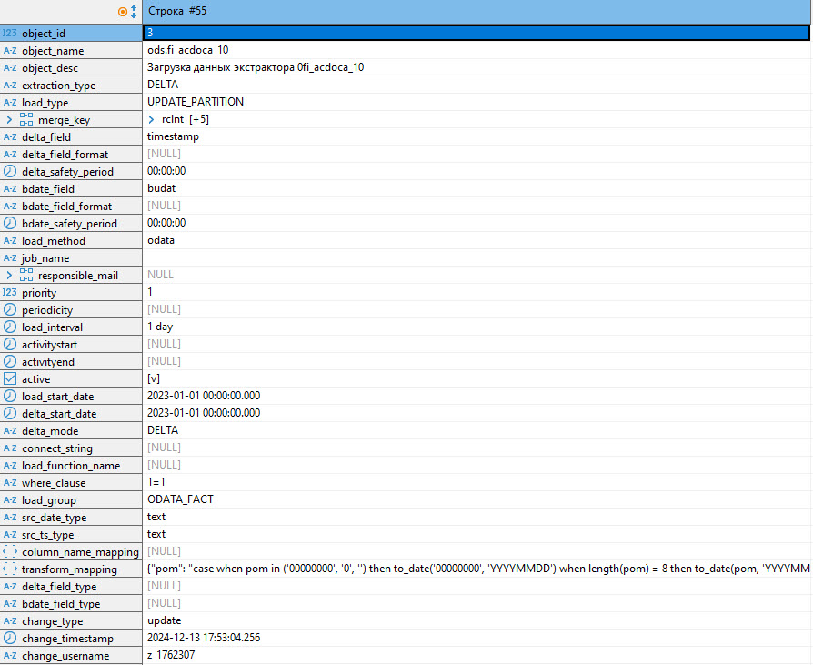
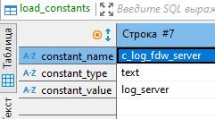
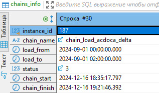
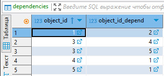
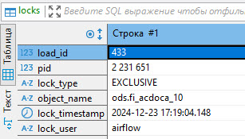

# Greenplum Framework Components

## Database Components

### Tables

- **objects**
  - Contains objects used for loading or calculations in the Greenplum DB.
  - May include technical tasks like running Python scripts on Airflow server (`start_gpfdist`, `kill_gpfdist`, `keep_alive_gpfdist`).

  **Example Record:**
  

- **load_info**
  - Contains IDs of loads and their metadata.

  **Example Record:**
  

- **logs**
  - Contains logs for corresponding load IDs.

  **Example Record:**
  

- **objects_log**
  - Logs changes to records in the `objects` table.

  **Example Record:**
  

- **load_constants**
  - Contains constants needed for framework-based loads.

  **Example Record:**
  

- **chains**
  - Contains process chain settings, sequences of objects from `objects` for DAG generation.

  **Example Record:**
  

- **chains_info**
  - Contains history of process chain runs.

  **Example Record:**
  

- **chains_log**
  - Contains logs for corresponding instance IDs of process chains.

  **Example Record:**
  

- **dependencies**
  - Contains dependencies in loads for DAGs generated based on `objects.load_group`.

  **Example Record:**
  

- **ext_tables_params**
  - Contains extended settings for external tables for odata and gpfdist load methods.

  **Example Record:**
  

- **locks**
  - Contains ETL locks set by the framework to enable parallel loading into a single table and avoid deadlock errors.

  **Example Record:**
  

- **odata_query_helper**
  - Contains information about the current state of package loading from the OData service.

  **Example Record:**
  

- **Dict Tables**
  - Tables like `d_delta_mode`, `d_extraction_type`, etc., contain key values and descriptions for dimensions used in main configuration tables.

  **Example Record:**
  

### Sequences

- **chain_log_id_seq**
  - Generates log IDs in the `chains_log` table.

- **instance_id_seq**
  - Generates instance IDs in the `chains_info` table.

- **load_id_seq**
  - Generates load IDs in the `load_info` table.

- **log_id_seq**
  - Generates log IDs in the `logs` table.

### Views

- **load_status_today**
  - Displays the status of loads in the data warehouse for today.

- **v_odata_query_helper**
  - Returns the current state of OData loading via autonomous transactions.

### Remote Access Server

- **log_server**
  - Postgres_fdw server for recording ETL process logs through autonomous transactions.

### Functions

# Knowledge Base

## Functions

Functions in the Greenplum Framework are used to perform various operations related to data loading, process management, and other tasks. Below is a list of functions along with their brief descriptions.

### f_analyze_table
- **Description**: Collect statistics on a table.
- **Application**: Used to improve query performance by collecting table statistics.

### f_create_date_partitions
- **Description**: Create date partitions in a partitioned table up to a specified date.
- **Application**: Helps manage large datasets by organizing them into date-based partitions.

### f_create_ext_table
- **Description**: Create an external readable table.
- **Application**: Enables reading data from external sources directly into Greenplum.

### f_create_ext_table_for_ch
- **Description**: Create an external writable table for Clickhouse.
- **Application**: Facilitates writing data from Greenplum to Clickhouse efficiently.

### f_create_obj_sql
- **Description**: Create a database object based on SQL code.
- **Application**: Allows dynamic creation of database objects using SQL scripts.

### f_create_tmp_table
- **Description**: Create a temporary staging table.
- **Application**: Provides a temporary storage area for intermediate data processing.

### f_delete_load_lock
- **Description**: Delete ETL locks.
- **Application**: Removes locks set during ETL processes to allow further processing.

### f_drop_partition_range
- **Description**: Drop a range of partitions.
- **Application**: Cleans up unused or outdated partitions to optimize storage.

### f_execute_function
- **Description**: Execute a function.
- **Application**: Runs a specified function dynamically within the framework.

### f_extract_data
- **Description**: Extract data from the source system.
- **Application**: Retrieves data from external systems for further processing.

### f_extract_data_for_ch
- **Description**: Extract data from the source system and load it into Clickhouse.
- **Application**: Integrates data extraction and loading into Clickhouse in one step.

### f_gen_group_load_id
- **Description**: Generate a load ID for a group of loads (load_group).
- **Application**: Ensures unique identification for groups of related loads.

### f_gen_instance_id
- **Description**: Get instance ID for a process chain.
- **Application**: Generates a unique identifier for each run of a process chain.

### f_gen_load_id
- **Description**: Generate a load ID for an individual object (object_id).
- **Application**: Provides unique identifiers for individual loads.

### f_get_connection_string
- **Description**: Get connection string to an external source.
- **Application**: Retrieves the necessary credentials and connection details for external systems.

### f_get_constant
- **Description**: Get a constant.
- **Application**: Retrieves predefined constants required for various operations.

### f_get_delta_table_name
- **Description**: Get the name of the staging table for delta load.
- **Application**: Identifies the correct staging table for delta data loading.

### f_get_distribution_key
- **Description**: Get the distribution key of a specified table.
- **Application**: Determines how data is distributed across segments in Greenplum.

### f_get_enum_partition
- **Description**: Get enum PXF partitions from a date interval.
- **Application**: Maps date ranges to corresponding PXF partitions.

### f_get_ext_ch_table_name
- **Description**: Get the name of the external table for loading into Clickhouse.
- **Application**: Identifies the external table used for Clickhouse data loading.

### f_get_ext_table_name
- **Description**: Get the name of the external table for loading into Greenplum.
- **Application**: Identifies the external table used for Greenplum data loading.

### f_get_extr_expression
- **Description**: Get the expression for extracting data from an external system and writing it to a staging table.
- **Application**: Constructs the SQL expression needed for data extraction.

### f_get_extract_where_cond
- **Description**: Get the condition for extracting data from an external system.
- **Application**: Defines the conditions under which data should be extracted.

### f_get_load_expression
- **Description**: Get the expression for extracting data from an external system and writing it to a staging table.
- **Application**: Similar to `f_get_extr_expression`, but specifically for load operations.

### f_get_load_expression_for_ch
- **Description**: Get the expression for loading data from Greenplum into Clickhouse.
- **Application**: Constructs the SQL expression needed for data loading into Clickhouse.

### f_get_load_function
- **Description**: Get the name of the load function.
- **Application**: Retrieves the specific function responsible for loading data.

### f_get_load_id
- **Description**: Get an existing load ID.
- **Application**: Retrieves the ID of an already initiated load operation.

### f_get_load_locks
- **Description**: Get a list of ETL locks on an object.
- **Application**: Lists all active locks associated with a particular object.

### f_get_locks
- **Description**: Get a list of system locks.
- **Application**: Provides an overview of all current locks in the system.

### f_get_max_value
- **Description**: Get the maximum value from a table field.
- **Application**: Finds the highest value in a specified column for analysis or reporting.

### f_get_merge_key
- **Description**: Get the update key for a table.
- **Application**: Identifies the key used for merging updates into a target table.

### f_get_min_value
- **Description**: Get the minimum value from a table field.
- **Application**: Finds the lowest value in a specified column for analysis or reporting.

### f_get_partition_interval
- **Description**: Get the partitioning interval of a table.
- **Application**: Determines the time span covered by each partition in a partitioned table.

### f_get_partition_key
- **Description**: Get the partitioning key of a table.
- **Application**: Identifies the column used for partitioning data in a table.

### f_get_pxf_partition
- **Description**: Get PXF partitions of a table.
- **Application**: Retrieves information about PXF partitions for data processing.

### f_get_session_param
- **Description**: Get a session parameter.
- **Application**: Retrieves configuration settings for the current session.

### f_get_table_attributes
- **Description**: Get the storage attributes of a table.
- **Application**: Provides detailed information about how a table is stored.

### f_get_table_schema
- **Description**: Get the schema of a table.
- **Application**: Retrieves the structure and definition of a table.

### f_get_where_clause
- **Description**: Get the WHERE clause from object settings.
- **Application**: Constructs the filtering conditions for data extraction.

### f_get_where_cond
- **Description**: Get the final WHERE condition for loading.
- **Application**: Refines the filtering criteria for loading operations.

### f_grant_select
- **Description**: Set permissions on a table based on a template.
- **Application**: Grants SELECT privileges to users following predefined rules.

### f_insert_table
- **Description**: Insert data from one table into another.
- **Application**: Transfers data between tables without needing complex joins or transformations.

### f_insert_table_sql
- **Description**: Insert data from an SQL expression into a table.
- **Application**: Executes SQL statements to insert data into a table directly.

### f_load_data
- **Description**: Load data from staging into the target table.
- **Application**: Moves processed data from staging areas to the final destination.

### f_load_delta_merge
- **Description**: Load data into a table through a default partition switch.
- **Application**: Manages data loading by switching partitions as needed.

### f_load_delta_partitions
- **Description**: Load data into a table through partition switches.
- **Application**: Loads data by changing partitions according to the data's timestamp.

### f_load_delta_update_partitions
- **Description**: Load data into a table through iterative partition updates.
- **Application**: Updates partitions incrementally rather than reloading entire datasets.

### f_load_full
- **Description**: Load data into a table through full overwrite.
- **Application**: Replaces all existing data in a table with new data.

### f_load_id_exists
- **Description**: Check if a load ID exists for the loading interval.
- **Application**: Verifies whether a load operation has already been initiated.

### f_load_object
- **Description**: Load data into a table using the function method.
- **Application**: Uses custom functions to handle data loading.

### f_load_simple
- **Description**: Load data from a source table/view into a target table with support for all available extraction and update methods.
- **Application**: Simplifies data loading by automating the extraction and transformation steps.

### f_load_simple_full
- **Description**: Load data into a table through full overwrite.
- **Application**: Similar to `f_load_full`, but simplified for easier use.

### f_load_simple_update
- **Description**: Load data into a table through updates (UPDATE).
- **Application**: Updates existing records in a target table with new data.

### f_load_simple_upsert
- **Description**: Load data into a table through updates (DELETE-INSERT).
- **Application**: Combines DELETE and INSERT operations to ensure data consistency.

### f_merge_tables
- **Description**: Compare tables by key, update, and form a new state.
- **Application**: Merges changes from multiple tables into a single consistent dataset.

### f_partition_name_by_value
- **Description**: Partition name by date.
- **Application**: Assigns names to partitions based on date values.

### f_partition_name_list_by_date
- **Description**: List partitions by date interval.
- **Application**: Provides a list of partitions covering a specific date range.

### f_post_extract_odata
- **Description**: Update metadata after OData load.
- **Application**: Refreshes metadata to reflect recent changes in OData data.

### f_prepare_extract_odata
- **Description**: Preliminary settings before OData load.
- **Application**: Prepares the environment for efficient OData data extraction.

### f_prepare_load
- **Description**: Create staging objects before loading into Greenplum.
- **Application**: Sets up necessary staging structures prior to data loading.

### f_prepare_load_to_ch
- **Description**: Create staging objects before loading into Clickhouse.
- **Application**: Prepares staging structures for Clickhouse-specific data loading.

### f_process_extract_odata
- **Description**: Extract data from OData.
- **Application**: Pulls data directly from OData services for further processing.

### f_replace_variables
- **Description**: Replace variables in a specified string.
- **Application**: Dynamically substitutes placeholders in strings with actual values.

### f_set_instance_id_error
- **Description**: Set instance ID to -1.
- **Application**: Marks a process chain instance as having encountered an error.

### f_set_instance_id_in_process
- **Description**: Set instance ID to 2.
- **Application**: Indicates that a process chain instance is currently running.

### f_set_instance_id_success
- **Description**: Set instance ID to 3.
- **Application**: Marks a process chain instance as successfully completed.

### f_set_load_id_error
- **Description**: Set load ID to -1.
- **Application**: Flags a load operation as having failed.

### f_set_load_id_in_process
- **Description**: Set load ID to 2.
- **Application**: Indicates that a load operation is currently in progress.

### f_set_load_id_success
- **Description**: Set load ID to 3.
- **Application**: Marks a load operation as successfully completed.

### f_set_load_lock
- **Description**: Set ETL lock.
- **Application**: Places a lock on a table to prevent concurrent modifications.

### f_set_session_param
- **Description**: Set a session parameter.
- **Application**: Configures session-level settings dynamically.

### f_stat_activity
- **Description**: Get all processes in the database.
- **Application**: Provides a snapshot of all active processes within the database.

### f_switch_def_partition
- **Description**: Switch the default partition.
- **Application**: Changes the default partition to facilitate data loading.

### f_switch_partition
- **Description**: Switch partition by date or name.
- **Application**: Modifies partitions based on date or explicit names.

### f_table_exists
- **Description**: Check if a table exists.
- **Application**: Verifies the presence of a table before performing operations on it.

### f_terminate_backend
- **Description**: Terminate a process by its PID.
- **Application**: Stops a specific backend process to release resources.

### f_terminate_lock
- **Description**: Remove ETL lock.
- **Application**: Releases locks previously set during ETL processes.

### f_truncate_table
- **Description**: Truncate a table.
- **Application**: Clears all data from a table quickly and efficiently.

### f_unify_name
- **Description**: Standardize a name.
- **Application**: Converts names to a standardized format for consistency.

### f_update_chains_info
- **Description**: Update the chains_info table.
- **Application**: Keeps the process chain information up-to-date.

### f_update_columns
- **Description**: Update fields in a table.
- **Application**: Modifies specific columns in a table with new values.

### f_update_load_info
- **Description**: Update the load_info table.
- **Application**: Maintains accurate records of load operations.

### f_update_table_sql
- **Description**: Update a table from an SQL expression.
- **Application**: Executes SQL statements to modify table data.

### f_upsert_table
- **Description**: Update a table through DELETE-INSERT.
- **Application**: Combines DELETE and INSERT operations for data synchronization.

### f_wait_locks
- **Description**: Wait for a table to be released from a lock.
- **Application**: Pauses operations until a lock on a table is lifted.

### f_write_chain_log
- **Description**: Write a process chain log.
- **Application**: Records detailed logs of process chain executions.

### f_write_log
- **Description**: Write an ETL process log.
- **Application**: Logs events and statuses during ETL processes for auditing and troubleshooting.

## Table Structures

### objects

| Field Name         | Data Type | Description                                                                 |
|--------------------|-----------|-----------------------------------------------------------------------------|
| object_id          | int8      | Sequential number of the object                                             |
| object_name        | text      | Object name (table name or technical task)                                  |
| object_desc        | text      | Object description                                                          |
| extraction_type    | text      | Extraction type from source (see d_extraction_type)                         |
| load_type          | text      | Data load type into the target (see d_load_type)                            |
| merge_key          | text      | Set of key fields in the target table                                       |
| delta_field        | text      | Delta field                                                                 |
| bdate_field        | text      | Business date field                                                         |
| bdate_field_format | text      | Business date field format                                                  |
| bdate_safety_period| interval  | Safety period for business date                                             |
| load_method        | text      | Load method (see d_load_method)                                             |
| job_name           | text      | Loading job name                                                            |
| responsible_mail   | text[]    | List of email addresses for sending error messages                          |
| priority           | int4      | Load priority                                                               |
| periodicity        | interval  | Load periodicity                                                            |
| load_interval      | interval  | Load interval                                                               |
| activitystart      | time      | Start time of load activity                                                 |
| activityend        | time      | End time of load activity                                                   |
| active             | bool      | Is load active?                                                             |
| load_start_date    | timestamp | Initial Load Date by Business Date                                          |
| delta_start_date   | timestamp | Initial Load Date by Delta                                                  |
| delta_mode         | text      | load_id generation mode (see d_delta_mode)                                  |
| connect_string     | text      | Connection string to source system (for pxf, gpfdist)                       |
| load_function_name | text      | Calculation/loading function (for load_method - function, python)           |
| where_clause       | text      | Additional loading filter (possibly using $[variable name] variables)       |
| load_group         | text      | Load group (см. d_load_group)                                               |
| src_date_type      | text      | "date" Field type in source system                                          |
| src_ts_type        | text      | "timestamp" Field type in source system                                     |
| column_name_mapping| jsonb     | S2T mapping if fields names differ                                          |
| transform_mapping  | jsonb     | S2T mapping if fields needs transformations                                 |
| delta_field_type   | text      | Delta field type in source system                                           |
| bdate_field_type   | text      | Business date field format type in source system                            |

### load_info

| Field Name         | Data Type | Description                                                                 |
|--------------------|-----------|-----------------------------------------------------------------------------|
| load_id            | int8      | Load ID                                                                     |
| load_status        | int4      | Load status (see d_load_status)                                             |
| object_id          | int8      | Object ID (see objects)                                                     |
| extraction_type    | text      | Extraction type from source (see d_extraction_type)                         |
| load_type          | text      | Data load type into the target                                              |
| extraction_from    | timestamp | Start of extraction interval                                                |
| extraction_to      | timestamp | End of extraction interval                                                  |
| load_from          | timestamp | Start of load interval                                                      |
| load_to            | timestamp | End of load interval                                                        |
| load_method        | text      | Load method (see d_load_method)                                             |
| job_name           | text      | Loading job name                                                            |
| created_dttm       | timestamp | Timestamp of load_id creation                                               |
| updated_dttm       | timestamp | Timestamp of load_id last update                                            |
| row_cnt            | int8      | number of downloaded/modified records                                       |

### logs

| Field Name         | Data Type | Description                                                                 |
|--------------------|-----------|-----------------------------------------------------------------------------|
| log_id             | int8      | Sequential log number                                                       |
| load_id            | int8      | Load ID (see load_info)                                                     |
| log_timestamp      | timestamp | Log time stamp                                                              |
| log_type           | text      | Log type                                                                    |
| log_msg            | text      | Log message                                                                 |
| log_location       | text      | Log location                                                                |
| is_error           | bool      | Is the message an error?                                                    |
| log_user           | text      | Log user                                                                    |

### objects_log

| Field Name         | Data Type | Description                                                                 |
|--------------------|-----------|-----------------------------------------------------------------------------|
| ...                |           | ...                                                                         |
| change_type        | text      | Change type                                                                 |
| change_timestamp   | timestamp | Timestamp of the change                                                     |
| change_username    | text      | User who modified the entry                                                 |

### load_constants

| Field Name         | Data Type | Description                                                                 |
|--------------------|-----------|-----------------------------------------------------------------------------|
| constant_name      | text      | Constant name                                                               |
| constant_type      | text      | Data type of the constant                                                   |
| constant_value     | text      | Value of the constant                                                       |

### chains

| Field Name         | Data Type | Description                                                                 |
|--------------------|-----------|-----------------------------------------------------------------------------|
| chain_name         | text      | Chain name                                                                  |
| chain_description  | text      | Chain description                                                           |
| active             | bool      | Activity flag                                                               |
| schedule           | text      | Chain schedule                                                              |
| job_name           | text      | DAG name                                                                    |
| sequence           | text      | Objects sequence                                                            |

### chains_info

| Field Name         | Data Type | Description                                                                 |
|--------------------|-----------|-----------------------------------------------------------------------------|
| instance_id        | int8      | Run ID                                                                      |
| chain_name         | text      | Process chain name (see chains)                                          |
| load_from          | timestamp | load_id.extraction_from setting                                             |
| load_to            | timestamp | load_id.extraction_to setting                                               |
| status             | int4      | Chain status (see d_load_status)                                            |
| chain_start        | timestamp | Chain start time                                                            |
| chain_finish       | timestamp | Chain finish time                                                           |

### chains_log

| Field Name         | Data Type | Description                                                                 |
|--------------------|-----------|-----------------------------------------------------------------------------|
| log_id             | int8      | Sequential log number                                                       |
| instance_id        | int8      | Instance ID of the process chain run (see chains_info)                   |
| log_timestamp      | timestamp | Log time stamp                                                              |
| log_type           | text      | Log type                                                                    |
| log_msg            | text      | Log message                                                                 |

### dependencies

| Field Name         | Data Type | Description                                                                 |
|--------------------|-----------|-----------------------------------------------------------------------------|
| object_id          | int8      | Object ID                                                                   |
| object_id_depend   | int8      | Dependent object ID                                                         |

### ext_tables_params

| Field Name         | Data Type | Description                                                                 |
|--------------------|-----------|-----------------------------------------------------------------------------|
| object_id          | int8      | Object ID (see objects)                                                     |
| load_method        | text      | Load method (see d_load_method)                                             |
| connection_string  | text      | Connection string to source system (for pxf, gpfdist)                       |
| additional         | text      | Additional info                                                             |
| active             | text      | Activity flag                                                               |
| object_name        | text      | Service name (for ODP)                                                      |

### locks

| Field Name         | Data Type | Description                                                                 |
|--------------------|-----------|-----------------------------------------------------------------------------|
| load_id            | int8      | Load ID                                                                     |
| pid                | int4      | Process ID in Greenplum                                                     |
| lock_type          | text      | Lock type (exclusive, share)                                                |
| object_name        | text      | Locked table name                                                           |
| lock_timestamp     | timestamp | Lock timestamp                                                              |
| lock_user          | text      | Lock user                                                                   |

### odata_query_helper

| Field Name         | Data Type | Description                                                                 |
|--------------------|-----------|-----------------------------------------------------------------------------|
| load_id            | int8      | Load ID                                                                     |
| sql_query          | text      | SQL query to insert data into the staging table                             |
| table_to           | text      | Target stage table                                                          |
| rows_count         | int8      | Number of inserted rows                                                     |
| delta_field        | text      | Delta field                                                                 |
| extraction_to      | timestamp | Delta right border                                                          |

### Reference Tables

| Field Name         | Data Type | Description                                                                 |
|--------------------|-----------|-----------------------------------------------------------------------------|
| load_method        | text/int  | Key value                                                                   |
| desc_short         | text      | Short description                                                           |
| desc_middl         | text      | Middle description                                                          |
| desc_long          | text      | Long description                                                            |
